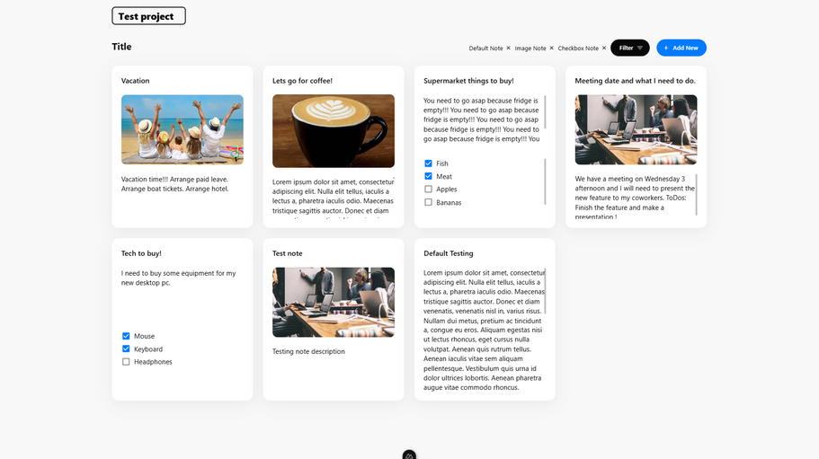
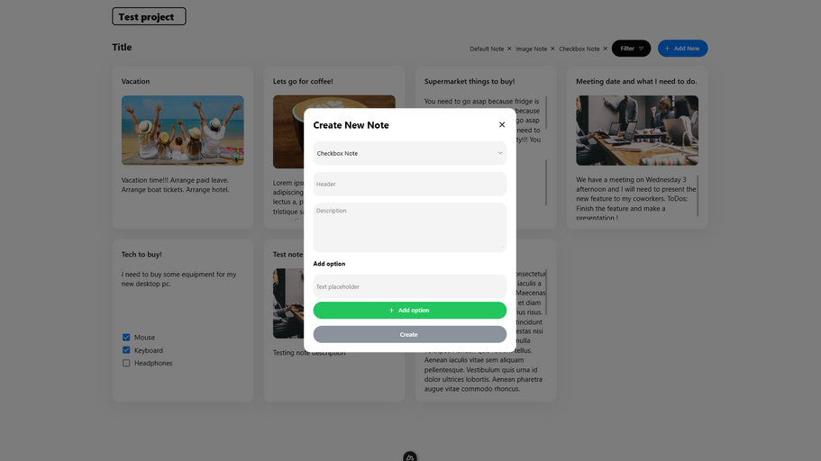
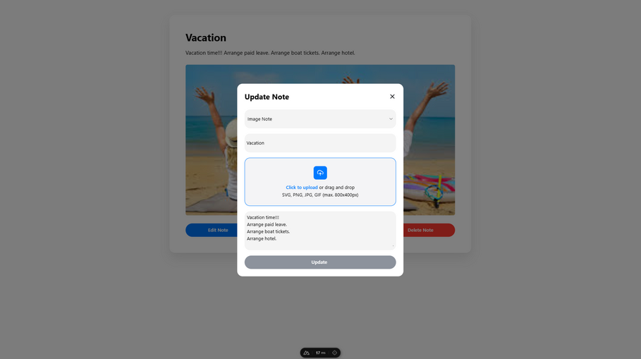

# Notes App

## Description

The Notes App is a web application built with Nuxt 3, Tailwind CSS, and Pinia for state management.

It allows users to create, view, edit, and delete notes. Each note can be categorized into one of three types, and users can filter notes by type on the home page.

The app also keeps the store alive through localStorage, ensuring that your notes persist even after refreshing the page.

## Features

- **Home Page**: View all notes with filtering options by type.
- **Add Note**: Create a new note by selecting a type and filling in the necessary details.
- **View Note**: Access individual notes via dynamic routing (`note/:slug`) to see details.
- **Edit Note**: Edit existing notes with a prefilled form.
- **Delete Note**: Remove notes from the application.

## Screenshots


_Home page with notes and filter options_


_Form to add a new note_


_Viewing a note with options to edit or delete_


_Form to edit a note_


_Dialog to delete a note_

## Installation

1. **Clone the repository**:

   ```bash
   git clone https://github.com/IraklisAsimakopoulos/notes-app.git
   ```

2. **Navigate to the project directory**:

   ```bash
   cd notes-app
   ```

3. **Install dependencies**:

   ```bash
   npm install
   ```

## Usage

1. **Start the development server**:

   ```bash
   npm run dev
   ```

2. **Open your browser** and go to `http://localhost:3000` to view the app.

## Built With

- **Nuxt 3**: A modern Vue.js framework for building server-side rendered applications.
- **Tailwind CSS**: A utility-first CSS framework for styling.
- **Pinia**: A state management library for Vue.js applications.

## Contributing

Contributions are welcome! Please follow these steps:

1. Fork the repository.
2. Create a new branch (`git checkout -b feature/your-feature`).
3. Commit your changes (`git commit -m 'Add some feature'`).
4. Push to the branch (`git push origin feature/your-feature`).
5. Open a pull request.

## License

This project is licensed under the MIT License - see the [LICENSE](LICENSE) file for details.

## Contact

Iraklis Asimakopoulos-Kouloulias - [iraklis.asimakopoulos@gmail.com](mailto:iraklis.asimakopoulos@gmail.com)

Project Link: [https://github.com/IraklisAsimakopoulos/notes-app](https://github.com/IraklisAsimakopoulos/notes-app)
